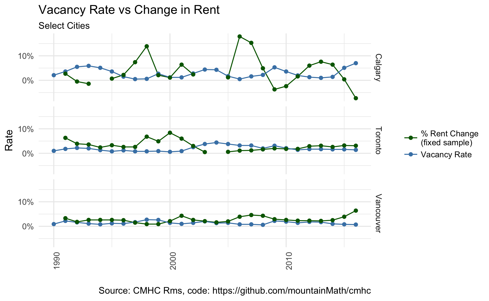
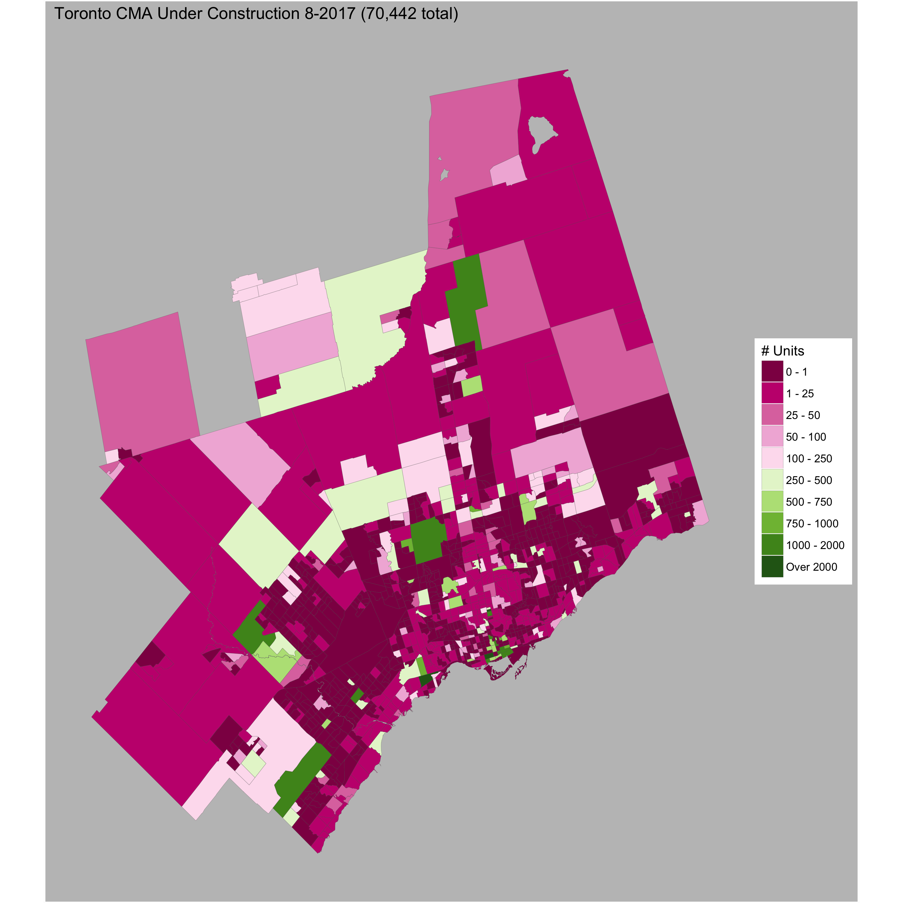

# cmhc
Wrapper for hack into CMHC data

To discover table parameters, open CMHC data portal and set breakpoint on line 74 of asset TableMapChart.js. Then "export" table, type and
inspect variable "model" in the console to read off the parameters.

## Example
Check out the [vignette plotting vacancy rate against fixed sample rent increases](https://htmlpreview.github.io/?https://github.com/mountainMath/cmhc/blob/master/vignettes/vacancy_vs_rent_change.nb.html) to see how this can be used.

Or we can fold in census geographies (and census data) to map the [current units under construction](https://github.com/mountainMath/cmhc/blob/master/vignettes/Under%20Construction.nb.html).

