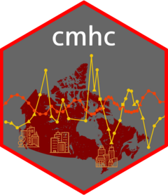

# cmhc

<!-- badges: start -->
[](https://github.com/mountainMath/cmhc/actions/workflows/R-CMD-check.yaml)
[](https://CRAN.R-project.org/package=cmhc)
[](https://cranlogs.r-pkg.org/badges/cmhc)
<!-- badges: end -->

<a href="https://mountainmath.github.io/cmhc/index.html"></a>


API wrapper for extracting CMHC data out of the [CMHC Housing Market Information Portal](https://www.cmhc-schl.gc.ca/hmiportal).


## Reference
Documentation is [available on the GitHub pages](https://mountainmath.github.io/cmhc/).

The example vignettes contain some [common use cases](https://mountainmath.github.io/cmhc/articles/basic_usage.html).

## Installation
The stable version of **cmhc** can be easily installed from CRAN.
```
install.packages("cmhc")
```

Alternatively, the latest development version can be installed from Github.
```
remotes::install_github("mountainmath/cmhc")
```

## Usage
Consult the example vignette for more information. As an example, this is how to extract time series information
for vacancy rate data by bedroom type for the Vancouver Census Metropolitan Area ("59933").

```
library(cmhc)
vacancy_data <- get_cmhc(survey="Rms",series="Vacancy Rate",dimension="Bedroom Type",
                         breakdown="Historical Time Periods",  geo_uid="59933")

```

Starting with version v.0.3.2 the package has an interactive query builder helper function `select_cmhc_table()` that interactively walks through the available data and builds parameters for `get_cmhc()` like the example above. This makes it easy to discover data and build function calls to CMHC tables.

## Contributing

* We encourage contributions to improve this project. The best way is through issues and pull requests.
* If you want to get in touch, we are pretty good at responding via email or via twitter at [@vb_jens](https://twitter.com/vb_jens). 

## Cite **cmhc**

If you wish to cite cmhc:

  von Bergmann, J. (2025) cmhc: R package to access, retrieve, and work with CMHC data. v0.2.10. DOI: 10.32614/CRAN.package.cmhc


A BibTeX entry for LaTeX users is
```
  @Manual{cmhc,
    author = {Jens {von Bergmann}},
    title = {cmhc: R package to access, retrieve, and work with CMHC data},
    year = {2025},
    doi = {10.32614/CRAN.package.cmhc},
    note = {R package version 0.2.10},
    url = {https://mountainmath.github.io/cmhc/},
  }
```

## Related packages

The cmhc package is designed to work well with the [**cancensus** package](https://mountainmath.github.io/cancensus/) working with Canadian Census data the [**cansim** package](https://mountainmath.github.io/cansim/) for regular StatCan tables, and matches the census geographies via a `GeoUID` column that is shared across these packages. The [**tongfen** package](https://mountainmath.github.io/tongfen/) facilitates making geographies from different census years that CMHC reports on comparable over time.

## CMHC Attribution

Subject to the [CMHC Data License Agreement](https://www.cmhc-schl.gc.ca/about-us/terms-conditions/hmip-terms-conditions), licensed products using CMHC data should employ the following acknowledgement of source:


### Acknowledgment of Source

a. You shall include the following notice on all reproductions of the Information:

>    Source: Canada Mortgage and Housing Corporation (CMHC), name of product or information, reference date. This information is reproduced and distributed on an “as is” basis with the permission of CMHC.

b. Where any Information is contained within a Value-added Product, you shall include on such Value-added Product the following notice:

>    Adapted from Canada Mortgage and Housing Corporation, name of product or information, reference date. This does not constitute an endorsement by Canada Mortgage and Housing Corporation of this product.
or any other notice approved in advance in writing by CMHC.


